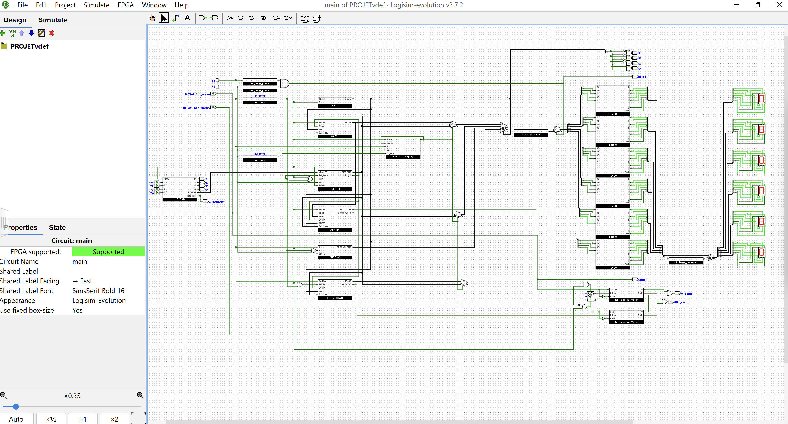

# TimeTime
TimeTime is a multifunction alarm watch (e.g. Casio) created on Logisim, using digital systems such as logic gates. It can be uploaded on an FPGA board, we worked on the DE10-Lite.
It was my third project at EPFL, in Bachelor Microengineering.

  

The TimeTime watch offer the following features : a clock, an alarm that plays The Imperial March, a chrono and a timer. 

The watch uses 6 seven-segment display, 2 buttons, 7 LEDs, 2 DIP switches and 2 peripherics : a keypad and a buzzer.

## Upload the circuit on an FPGA board
Open the file [TimeTime](TimeTime.circ) with Logisim-evolution v3.7.2. To upload it on an FPGA board, use the menu FPGA>"Synthesize & Download". Then you have to connect the different I/O of the board corresponding to the I/O of the circuit. (You can refer to the document [report](report.pdf).)

## How it works ?
As you turn on the FPGA, do a long press simultaneously on B1 and B2 (general reset). The watch displays "/" and the reset LED turns on, that indicates the reset is done. You can release the buttons. Then the watch displays the time, it is the clock state.

The time is displayed as : HH.MM.SS.

There are 4 states : clock, alarm, chrono, timer. You can navigate through the different states in the present order using B1 (long press).
The current state is indicated by the 4 state LEDs.

+ The clock state displays the time. B2 (long press) allows you to set the time (set function).
+ The alarm state displays the alarm time. B2 (long press) allows you to set the alarm (set function). The alarm DIP switch set the alarm on/off. The alarm LED turns on if the alarm is on. When the alarm rings, The Imperial March is played on the buzzer. You can turn it off with the alarm DIP switch.
+ The chrono state displays the chrono. B1 (short press) starts/stops the chrono, B2 (short press) clear the chrono.
+ The timer state displays the timer. B2 (long press) allows you to set the alarm (set function), B1 (short press) starts/stops the timer.

The set function enables you to use the keyboard to enter a value. As you launch the function, the watch displays many "-". You can enter the first digit. The data ready LED turns off when the data has been processed, that means you can use the keyboard again. To enter the next digit, use B2 (short press). As all the digits have been validated, the the watch displays the current state.
To cancel the set function, use B1 (short press). The the watch displays the current state.

Bonus function : the reverse DIP switch allows you to reverse the display anytime. You can use this function if you look at your watch upside down.

## Logisim
This project uses the software Logisim-evolution v3.7.2. You may encounter some issues if you try to open it with an earlier version.

## License
[MIT License](LICENSE)
